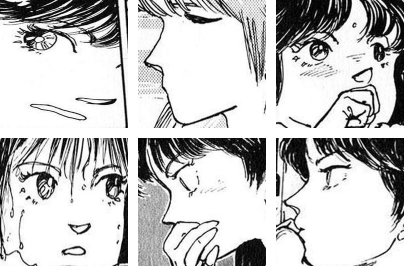

# Extraction Demo

Code referenced from the [manga109api](https://github.com/manga109/manga109api) repository.

## Usage
Executing `python extract.py` will output a cropped image/s based on the specified annotation provided.

When using the code, please make sure this script is in the manga109api directory along with the dataset. For a usage example, if you want to extract a faces from 5 pages of YumeNoKayoiji's book, please run the following command : 

```python
python extract.py --book YumeNoKayoiji --annotation face --pages 5 --preprocess --size 256
```

## Output
This will result in a folder being created called 'manga109extracted' and will be filled with face images from the 5 pages in the YumeNoKayoiji's book.
If you run the same script on a different book, it will be added to the same folder with filenames matching the book.


