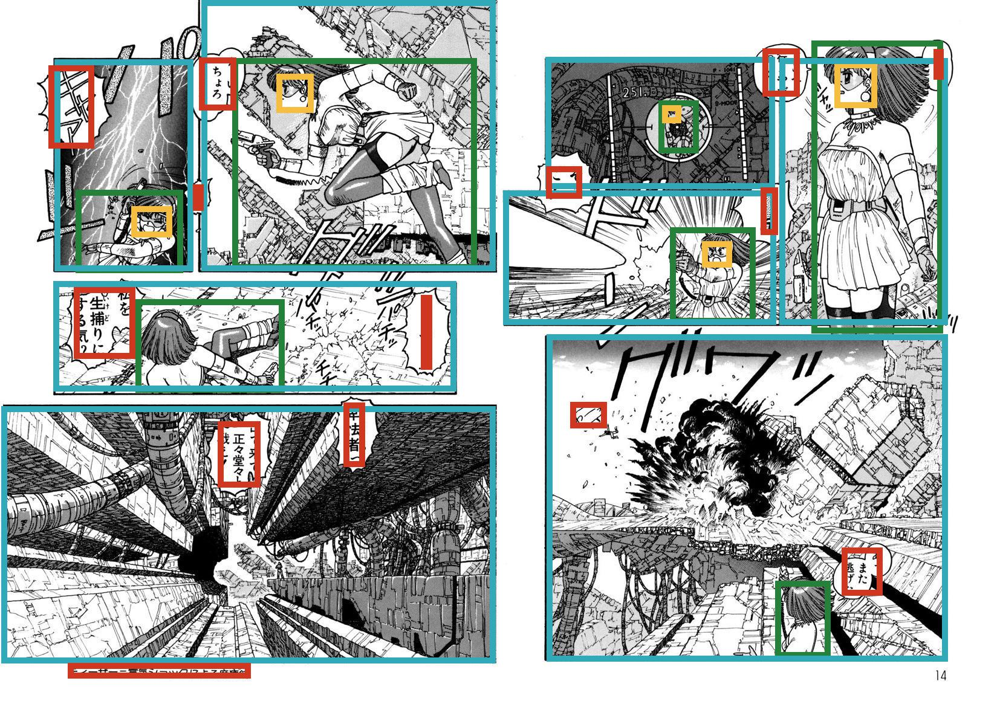

# Visualization Demo

Code referenced from the [manga109api](https://github.com/manga109/manga109api) repository.

## Usage
Executing `python visualization.py` will output the image shown in the Output section.

When using the code, please specify your dataset path. For example, if you would like to visualize the page 6 of "ARMS", please run the following command : 

```python
python visualization.py --manga109_root_dir YOUR_DIR/Manga109_2017_09_28 --book ARMS --page_index 6
```

## Output
This demo outputs the following image:



ARMS, (c) Masaki Kato